<div align="center">


[](https://p5js.org/)


Figure 1: The initial game screen of Deep Sea Prospector, showing the mode selection interface (Shallow Water / Deep Sea) and the submarine-themed visual style.

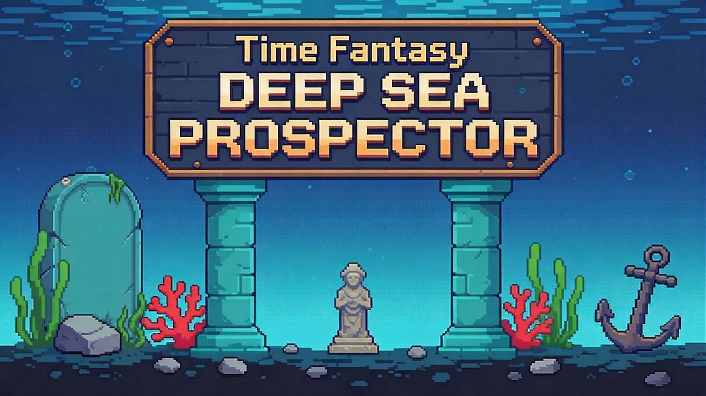

<br>

</div>

<div align="center">

<a href="https://uob-comsm0166.github.io/2026-group-4/">**🎮 Click this link to play our game 🎮**</a>
<br><br>
<a href="https://youtu.be/wD5Q11uhiyU">**🎬 Click this link to watch our game video 🎬**</a>
<br><br>
<a href="https://github.com/orgs/UoB-COMSM0166/projects/158">**📋 Group Kanban Board 📋**</a>
<br><br>
<a href="./progress/">**📁 Click here to view our Weekly Progress 📁**</a>

</div>

## 📑 Table of Contents

1. [Development Team](#1-development-team)
2. [Introduction](#2-introduction)
3. [Requirements](#3-requirements)
4. [Design](#4-design)
5. [Implementation](#5-implementation)
6. [Evaluation](#6-evaluation)
7. [Sustainability](#7-sustainability)
8. [Process](#8-process)
9. [Conclusion](#9-conclusion)
10. [Contribution Statement](#10-contribution-statement)
11. [AI Statement](#11-appendix)
12. [References](#12-references)

---

<a id="1-development-team"></a>

## 👨‍💻 1. Development Team

<div align="center">

Figure 2: Group 4 development team members.
  
  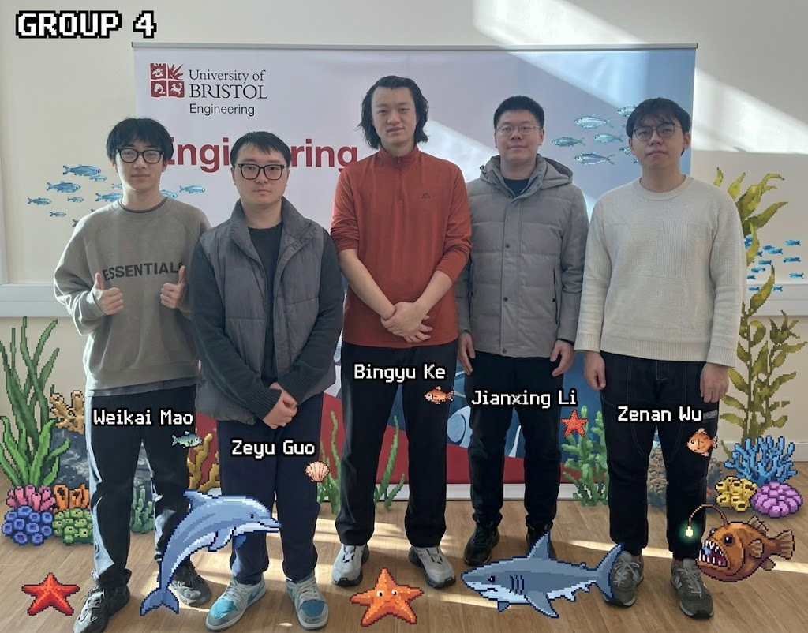
  
</div>

<div align="center">


Table 1: Team Members


| Name            | Email                 | Github                                                    | Role |
| :-------------- | :-------------------- | :-------------------------------------------------------- | :--- |
| **Weikai Mao**  | uz25020@bristol.ac.uk | [M1yanoShiho](https://github.com/M1yanoShiho)             | Gameplay Programmer, Level Designer |
| **Zenan Wu**    | jp25459@bristol.ac.uk | [zenanwu479-glitch](https://github.com/zenanwu479-glitch) | Gameplay Programmer, Asset Creator |
| **Jianxing Li** | ue25937@bristol.ac.uk | [UoB26Git](https://github.com/UoB26Git)                   | Gameplay Programmer, Asset Creator|
| **Bingyu Ke**   | wp25446@bristol.ac.uk | [Howard Ke](https://github.com/HowardKe-UOB)              | Test Engineer, Optimization Engineer |
| **Zeyu Guo**    | rp23254@bristol.ac.uk | [bytevostg](https://github.com/bytevostg)                 | Backend Developer, UI Designer ,Srum Master|


</div>

---

<a id="2-introduction"></a>

## 🚀 2. Introduction

<br>
<p align="center">
  <font color="#888888"><b>Figure 3: Classic Game (Gold Miner) &nbsp;&nbsp;&nbsp;&nbsp; & &nbsp;&nbsp;&nbsp;&nbsp; Figure 4: Our Game Demo</b></font><br><br>
  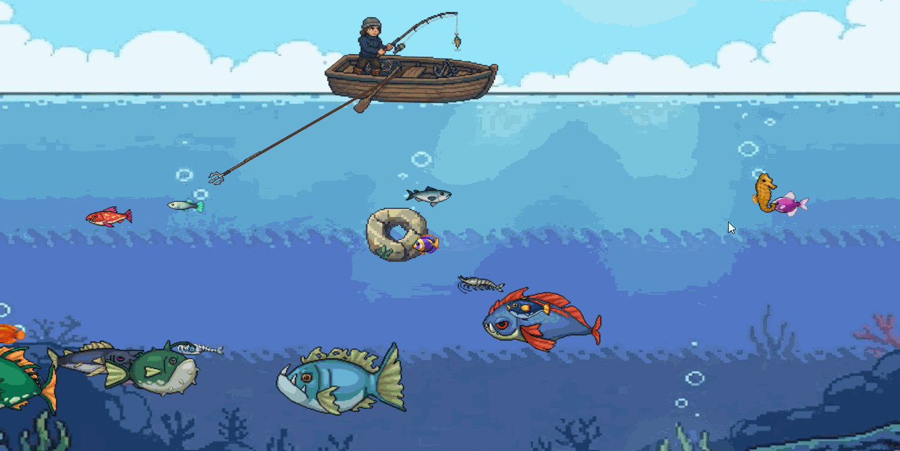
  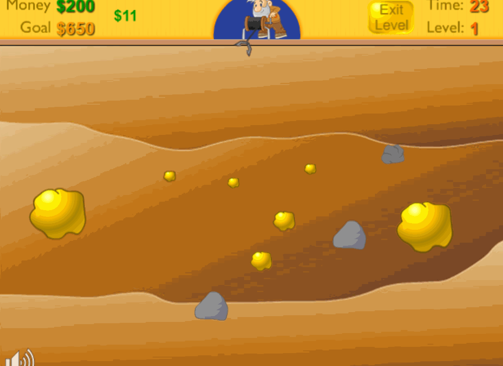
</p>
<br>

Deep Sea Prospector is a 2D pixel-style casual resource collection game developed using the p5.js library. Inspired by the classic game Gold Miner, our project reinterprets the core gameplay within an ocean exploration setting. Players control a hook deployed from a boat to capture various underwater objects and accumulate as many points as possible within a limited time, progressing through increasingly challenging levels with higher score requirements.

The game features a wide variety of collectible objects, including fish of different sizes, shells, pearls, stones, and treasure chests. Each item is designed with distinct attributes such as weight, movement speed, and value, creating a dynamic and strategic gameplay experience. While high-value targets like large fish and pearls offer greater rewards, players must carefully avoid low-value or obstructive items such as rocks and fish bones, which can significantly reduce efficiency and waste valuable time.

To enhance playability and replayability, a shop system is introduced between levels, where players can spend their accumulated score on items with diverse effects. At least three items are randomly generated in each visit, including both consumable and persistent upgrades, encouraging strategic resource management. In addition, purchasing a submarine unlocks the “Deep Sea Mode,” a high-risk, high-reward environment featuring limited visibility, dangerous predators such as sharks, and more valuable targets.
<br>
<p align="center">
  <font color="#888888">Figure 5: Store interface</font><br><br>
  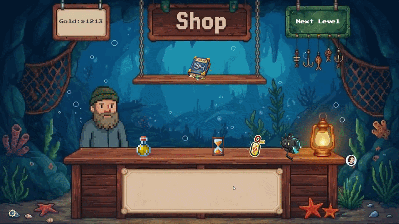
</p>
The game supports both single-player and two-player modes, as well as two difficulty levels. Additional systems, including a leaderboard and a collection log, further enrich the gameplay experience and promote long-term player engagement.
<br>

<p align="center">
  <font color="#888888">Figure 6: Two-Player Mode</font><br><br>
  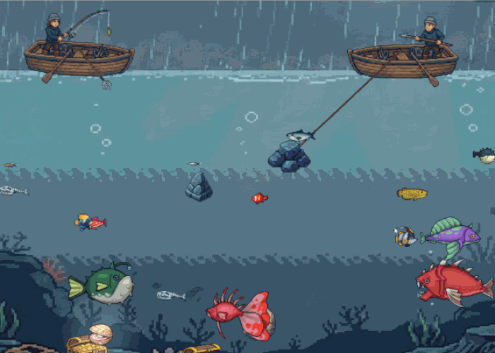
</p>
<br>
</div>

<div align="center">

Table 2: Main Game Objects


| Name | Image | Description |
| :---: | :---: | :---: |
| Boat | 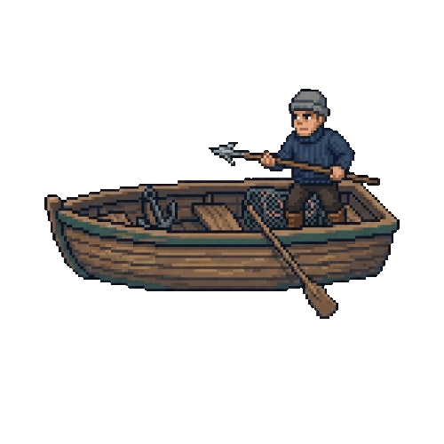 | The player's base. The hook is deployed from the boat to capture underwater objects. |
| Small Fish |  | Small, fast-moving fish with low weight and low value. |
| Big Fish |  | Large, slow-moving fish with high weight and high value. |
| Koi Fish |  | A rare species of fish. Moves very fast, medium size and weight, but extremely valuable. If it escapes the screen, it will not return. |
| Shark | 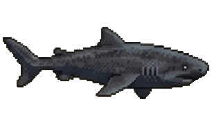 | Appears in Deep Sea Mode. A predator that can steal captured fish. Cannot be hooked. |
| Rock | 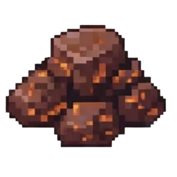 | Heavy and low-value obstacle that wastes time when captured. |
| Shell | 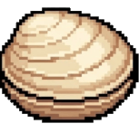 | High-value item that is difficult to catch and requires precise timing. |
| Treasure Chest |  | Found at the seabed. Very heavy but highly valuable. Unlike fish, it does not move. |
| AnglerFish | 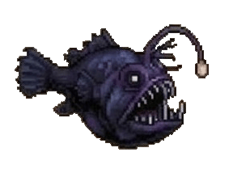 | Appears in deep-sea mode. A rare glowing fish, highly valuable, requires precise timing to catch. |


</div>

---

<a id="3-requirements"></a>

## 📋 3. Requirements

### 3.1 Ideation Process

<div align="center">

**Paper Prototype of Deep Sea Prospector**
<br><br>
<video src="https://github.com/user-attachments/assets/fca9d025-2279-4b16-b439-3e32f4e623b9" controls width="1400"></video>

</div>

Our initial motivation was to create a game with simple controls and an immediately responsive feedback loop, drawing inspiration from classic arcade experiences. During the early ideation phase, each team member proposed different game concepts with varying levels of complexity. For example, one idea was inspired by Fruit Ninja, reimagined as a “cutting homework” game where players slice objects within a limited time. Another proposal was based on Contra, aiming to develop a 2D side-scrolling shooter with platforming elements.

However, through group discussion and evaluation, we identified limitations in both approaches. The slicing game, while easy to implement, lacked sufficient depth and long-term engagement. In contrast, the Contra-style game introduced significant technical and design challenges, including complex level design, character movement systems, and a large demand for art assets, making it difficult to complete within the project scope.

As a result, we shifted our focus toward an arcade-style resource collection game inspired by Gold Miner, which provided a balanced middle ground between simplicity and depth. This direction allowed us to emphasize core mechanics such as timing, precision, and risk–reward decision-making, while maintaining a manageable development scope.

The paper prototyping phase played a crucial role in refining our concept. By simulating gameplay manually, we validated the effectiveness of the core loop and improved the balance between challenge and reward. Feedback from peer groups further confirmed the clarity and engagement of our design. Consequently, we finalized Deep Sea Prospector, focusing on intuitive controls, satisfying feedback, and a scalable gameplay loop.


### 3.2 Stakeholder table

To support the development of Deep Sea Prospector, we identified key stakeholders and analyzed their needs to guide design decisions. Our primary focus was on different player types, including casual players, challenge seekers, and multiplayer users, each with distinct expectations regarding gameplay simplicity, difficulty, and interaction.

We also considered internal stakeholders such as developers and designers, whose requirements influenced system implementation and visual design. In addition, evaluators (e.g., lecturers and playtesters) were treated as surrogate stakeholders, providing valuable feedback that reflects broader user perspectives.

User needs were formalized using the “As a…, I want…, so that…” structure and translated into testable acceptance criteria with the Given–When–Then format. This approach ensured a clear, user-centered, and implementable design process.


</div>

<div align="center">

Table 3: Stakeholder Table

| Stakeholder                  | Epic                         | User Story                                                                                                                                              | Acceptance Criteria                                                                                                                                                                                                 |
|-----------------------------|------------------------------|----------------------------------------------------------------------------------------------------------------------------------------------------------|----------------------------------------------------------------------------------------------------------------------------------------------------------------------------------------------------------------------|
| **User: Casual Player**     | Core Fishing Mechanics       | As a casual player, I want simple and intuitive controls, so that I can quickly understand the game and start playing without a tutorial.               | Given the hook is swinging,<br>When I press the "Down Arrow Key",<br>Then the hook should stop swinging and extend downward in a straight line.                                                                   |
| **User: Challenge Seeker**  | Risk–Reward Gameplay         | As a challenge seeker, I want hazards such as sharks that can interfere with my progress, so that the game feels tense and rewarding.                   | Given I am reeling in a fish,<br>When a shark collides with the captured object,<br>Then the fish should be removed and no score is awarded.                                                                      |
| **User: Strategic Player**  | Item Variety & Decision-Making | As a strategic player, I want different objects with varying weights and values, so that I must choose carefully when to hook targets.                  | Given multiple objects are present,<br>When I hook a heavy object,<br>Then the retraction speed should be slower compared to lighter objects.                                                                     |
| **User: Progression Gamer** | Economy & Progression Loop   | As a progression-focused player, I want a shop system between levels, so that I can improve my performance in later stages.                              | Given I enter the shop,<br>When I purchase an item,<br>Then my score is deducted and the item effect is applied in the next level.                                                                                 |
| **User: Multiplayer Player**| Cooperative Gameplay         | As a multiplayer player, I want to play with another player simultaneously, so that the game becomes more interactive and competitive.                  | Given two players are in the game,<br>When both players press their control keys,<br>Then two independent hooks should operate without interference.                                                               |
| **User: Explorer**          | Deep Sea Mode                | As an advanced player, I want to unlock a more challenging mode, so that I can experience higher risk and reward.                                       | Given I purchase the submarine,<br>When the next level starts,<br>Then the environment should switch to limited visibility with new enemies and higher-value targets.                                              |
| **Developer**               | Core System Implementation   | As a developer, I want a reliable collision detection system, so that interactions between hooks and objects are accurate and consistent.              | Given the hook intersects with an object,<br>When collision is detected,<br>Then the hook should attach to the object and begin retracting.                                                                        |
| **Artist/Designer**         | Visual Feedback & UX         | As a designer, I want clear visual feedback for player actions, so that players can easily understand game states and outcomes.                         | Given an object is captured,<br>When the hook connects,<br>Then the object should display a distinct animation or visual response.                                                                                 |
| **Evaluator (Lecturer)**    | Usability & Clarity          | As an evaluator, I want the game to demonstrate clear mechanics and progression, so that its design quality can be effectively assessed.               | Given a new player starts the game,<br>When they play without instructions,<br>Then they should understand the core gameplay loop within a short time.                                                              |

</div>

<div align="center">

Figure 7: Stakeholder Diagram

  
</div>

### 3.3 Reflection

During the development of Deep Sea Prospector, our team adopted a Value vs Effort Matrix to prioritize tasks and guide decision-making. This approach allowed us to focus on high-value, low-effort features while avoiding unnecessary investment in low-value, high-effort elements, such as overly complex visual designs. As a result, we were able to manage our time effectively and ensure steady progress throughout the project.

We also refined our understanding of user acceptance criteria to better define core gameplay requirements. For example, the hook must swing at a consistent speed and respond instantly to player input, ensuring responsive and intuitive controls. In addition, progression is determined by whether the player reaches the target score within the time limit, clearly defining success and failure conditions. Advanced gameplay elements, such as Deep Sea Mode, introduce additional challenges including reduced visibility and hostile creatures, enhancing the risk–reward dynamic. Special objectives, such as capturing rare targets within limited time, further increase gameplay depth.

Finally, our stakeholder analysis highlighted the importance of balancing user experience with technical feasibility and visual design. By considering not only players but also developers and designers, we recognized that successful game development requires integrating usability, implementation constraints, and aesthetic quality into a coherent design.

### 3.4 Use-Case Diagram

<div align="center">

Figure 8: Use Case Diagram
  
  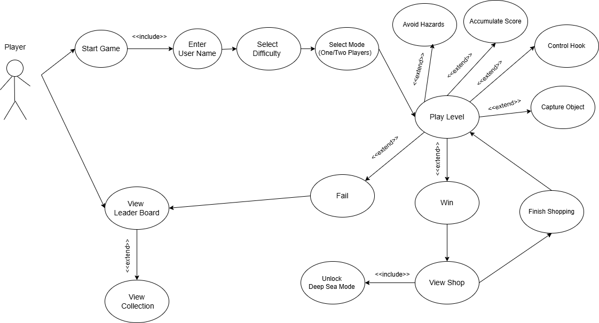
  
</div>

We used a use case diagram to identify and structure the core functional components of Deep Sea Prospector, providing a clear overview of player interactions and system behavior. During the design phase, we discussed and defined the primary use cases based on our gameplay loop and user stories, ensuring that all essential features were captured.

The diagram illustrates a primarily linear interaction flow. Players begin by starting the game, selecting the game mode (single-player or multiplayer), and choosing a difficulty level. Once the game starts, the core gameplay revolves around controlling the hook to capture objects, avoid hazards, and accumulate score within a limited time. These actions form the central gameplay loop and are represented as key use cases.

Additional systems, such as the shop and progression mechanics, are also included. After completing a level, players can enter the shop to purchase items that enhance performance in subsequent levels. Furthermore, advanced features such as unlocking the “Deep Sea Mode,” as well as viewing the leaderboard and collection system, extend the gameplay experience beyond the core loop.

Although additional features were introduced during development, the use case diagram remained a stable foundation, supporting iterative refinement while maintaining a clear structure of system functionality.


### 3.5 Prioritised Feature Breakdown

A risk-managed development roadmap prioritising the core hook mechanic and level progression before advanced systems and multiplayer features.

- **HIGH:** Realize the basic functions of the game
- **MEDIUM:** Enhance the depth of gameplay
- **LOW:** Extra point

</div>

<div align="center">

Table 4: Prioritised Feature Breakdown

| **Priority**            | **Systems / Features**                                                      | **Estimated Implementation Time** |
| :---------------------- | :-------------------------------------------------------------------------- | :-------------------------------- |
| **HIGH (MVP)**          | Hook Oscillation & Launch Mechanic (pivot rotation, trigger, reeling logic) | 2–3 days                          |
|                         | Object Detection & Collision System (fish, treasure, rocks hitboxes)        | 2–3 days                          |
|                         | Weight-Based Reeling Speed (heavier objects reel slower)                    | 1–2 days                          |
|                         | Time-Based Level Goal (quota + countdown timer)                             | 1–2 days                          |
|                         | Core Level Loop (start → play → results screen → next level)                | 1–2 days                          |
|                         | Basic Fish Types (common, rare, moving patterns)                            | 1–2 days                          |
|                         | UI System (timer, money counter, quota display)                             | 2–3 days                          |
|                         | Ranking List (local leaderboard system)                                     | 2+ days                           |
| **MEDIUM (Core Depth)** | Basic Obstacles (volcanic rocks blocking hook)                              | 1–2 days                          |
|                         | Shark Interception System (fish eaten while reeling)                        | 2–3 days                          |
|                         | Shop System (purchase upgrades & consumables)                               | 2–3 days                          |
|                         | Item: Rare Fish Bait (spawns Golden Koi next level)                         | 2+ days                           |
|                         | Item: Laser Sight Upgrade (trajectory visualization)                        | 2+ days                           |
|                         | Reinforced Claw (retrieve huge objects)                                     | 2+ days                           |
|                         | Massive Obstacle (requires Reinforced Claw)                                 | 2–4 days                          |
|                         | Ocean Current System                                                        | 2–3 days                          |
|                         | Shallow vs Deep Water Zones (affecting claw retrieval speed)                | 2–3 days                          |
|                         | Audio Feedback System (hook launch, catch, shark bite, shop)                | 2–3 days                          |
| **LOW (Stretch)**       | Advanced Fish Behaviours (e.g., fast dash patterns)                         | 2+ days                           |
|                         | Two-Player Mode (dual hook setup)                                           | 4+ days                           |
|                         | Procedural Level Variations (object distribution randomizer)                | 2–4 days                          |
|                         | Visual Effects Polish (water distortion, glow, particle effects)            | 3+ days                           |

</div>

---

<a id="4-design"></a>

## 📐 4. Design

### 4.1 System Architecture Overview

Deep Sea Prospector adopts a modular, object-oriented architecture with clearly defined responsibilities. The design follows the Single Responsibility Principle, while emphasizing high cohesion and low coupling to ensure maintainability, scalability, and ease of future extension.

The system is structured into several logical layers, including game state management, level control, player progression, and core gameplay mechanics. This separation of concerns allows each subsystem to evolve independently without affecting the overall stability of the application.

Core components include:

- **GameManager** — Acts as the central controller of the system, coordinating all major subsystems and managing transitions between different game states, such as the title screen, gameplay, shop, and result screens. 
- **LevelManager** — Responsible for configuring level-specific parameters, including target scores, time limits, difficulty scaling, and the dynamic spawning of sea creatures and items. 
- **ShopManager** — Manages all shop-related functionalities, including refreshing available items, handling purchase transactions, and maintaining a record of items currently owned by the player.
- **Player** — Handles player-related data and progression, including gold accumulation, upgrade management, and input handling during gameplay. 
- **Hook** — Implements the core gameplay mechanics, including swinging motion, launch behavior, collision detection, item capture, and retrieval, incorporating weight-based physics for more realistic interactions. 
- **SeaItems** — An abstract base class that defines a unified interface for all interactable objects (e.g., fish, treasures, and obstacles), enabling polymorphic behavior and consistent interaction handling across different item types.


### 4.2 Class Diagram

<div align="center">

Figure 9: Class diagram showing the object-oriented structure of Deep Sea Prospector.

  
</div>

The Deep Sea Prospector architecture follows a modular, object-oriented design to ensure system extensibility. GameManager acts as the central hub, coordinating the LevelManager (gameplay loop), Player (progression), and ShopManager (economy). It utilizes GameState and Difficulty enumerations to maintain logic consistency across different game phases.

For game entities, GameObject serves as the abstract base class for both Hook and SeaItem. SeaItem leverages polymorphism, allowing subclasses to implement specific movement behaviors and weights. These physical attributes directly influence the Hook's retrieval speed, creating a satisfying risk-reward loop. This decoupled structure allows for seamless integration of new marine life or shop upgrades without altering core mechanics.


### 4.3 Sequence Diagrams

#### 4.3.1 Game Initialization and Level Start

<div align="center">

Figure 10: Sequence diagram illustrating the game initialization flow from difficulty selection to level start.

  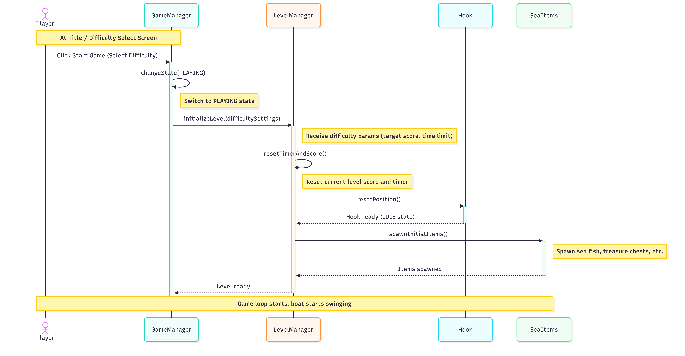
</div>

This sequence diagram demonstrates the transition from the UI menu to the active game state:

•	State Transition: The process begins when the player confirms their selection; the GameManager calls changeState(GameState.PLAYING).

•	Object Instantiation: The GameManager initializes a new LevelManager, passing parameters such as currentDifficulty, levelNum, and the player instance.

•	Environment Configuration: The LevelManager calculates the targetScore and timeLimit based on the difficulty. It then checks player.hasSubmarine to set the isDeepSea flag and triggers the spawning of SeaItem subclasses (e.g., BaseFish, Treasure) according to the level configuration.


#### 4.3.2 Hook Capture Mechanism

<div align="center">

Figure 11: Sequence diagram showing the hook deployment, collision detection, and item retrieval process.

  
</div>

This sequence highlights the real-time physics interaction between the player’s input and game entities:

•	Deployment: When a down-arrow input is detected, the GameManager triggers hook.deployDown(). The Hook transitions from IDLE_SWINGING to MOVING_DOWN, increasing its length each frame.

•	Collision and Grabbing: The system performs continuous collision detection. Once a hit is confirmed, the Hook calls grabItem(item), attaches the SeaItem, and switches to the MOVING_UP state.

•	Weighted Retrieval: During retrieval, the Hook executes moveWithItem(). The moveSpeed is dynamically adjusted based on the attached item's weight, simulating physical resistance.

•	Data Synchronization: Upon reaching the origin, returnComplete() is triggered. The LevelManager calls player.addScore(item.scoreValue) to update the persistent score before the item is destroyed.


#### 4.3.3 Level Completion and Result Evaluation

<div align="center">

Figure 12: Sequence diagram depicting the level end condition checking and result screen transition.

  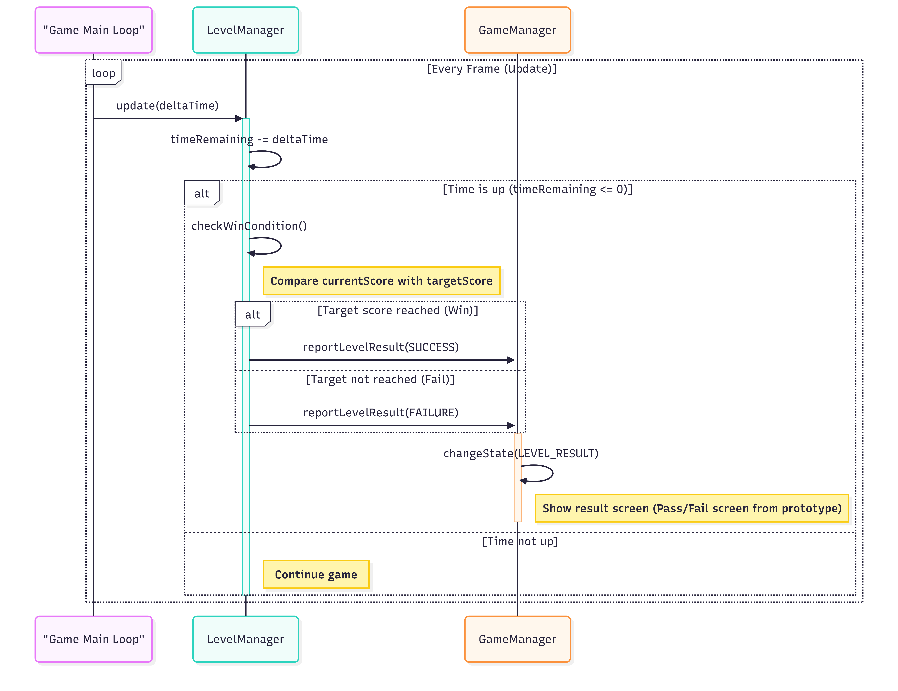
</div>

This diagram illustrates the logic governing win/loss conditions and the subsequent state cleanup:

•	Timer Monitoring: The LevelManager updates its internal timer during each update() cycle. When the time expires, it halts gameplay to evaluate the player's performance.

•	Condition Checking: The system compares the player.totalScore against the required targetScore.

•	State Finalization: The LevelManager communicates the outcome to the GameManager. The GameManager then calls changeState(GameState.LEVEL_RESULT), rendering the appropriate result screen. Finally, it interacts with the HighScoreManager to save the session data.


### 4.4 Design Patterns and Principles

Our architecture applies key design patterns:

**State Pattern**: To manage the complex game flow, the GameManager utilizes a flow control between states (TITLE, PLAYING, SHOP, LEVEL_RESULT). Similarly, the Hook employs behavior states—IDLE, MOVING_DOWN, and MOVING_UP—to encapsulate movement logic and prevent input conflicts during retrieval.

**Factory Pattern & Inheritance**: To facilitate Procedural Generation, the LevelManager uses a Factory Pattern for dynamic SeaItem creation. By establishing an inheritance hierarchy (with SeaItem as the base class for SmallFish, Treasure, etc.), we achieved high reusability and simplified the addition of new marine entities.

**Observer Pattern**: Enabling loose coupling between Hook and TargetItem via event callbacks (onCollision, returnComplete). This modular design facilitates easy extension of new features and independent testing of components.

Consistent with Agile methodologies, our design evolved through iterative testing. Initially, our controller logic was monolithic; however, we later separated rendering from core physics to ensure smooth performance in "Deep Sea Mode." This modular approach allowed for independent component testing and provided the flexibility to adjust the game's "risk-reward" balance without disrupting the foundational source code.


---

<a id="5-implementation"></a>

## 💻 5. Implementation

### 5.1 Overview

Deep Sea Prospector was implemented using P5.js, a JavaScript library that provides comprehensive tools for creative coding and interactive graphics. The implementation focused on three connected goals: creating responsive physics-based hook mechanics, building a mathematically guided balance framework for progression across Shallow Water and Deep Sea modes, and adding a lightweight cloud-backed leaderboard with a fish collection index to strengthen replay motivation. Our development process therefore centered on three technical challenges: (1) implementing realistic hook physics with multi-state collision detection, (2) designing fair score and economy scaling using an expected-value perspective, and (3) structuring shared run records so players can compare results and collections without introducing heavy data-fetch overhead.

### 5.2 Technical Challenge 1: Physics-Based Hook Mechanics and Collision System

The core gameplay revolves around the hook mechanism, which required implementing several interconnected systems to achieve smooth, responsive, and realistic behavior.

**Hook State Machine Implementation**

The hook operates through a finite state machine with three primary states: `IDLE_SWINGING`, `MOVING_DOWN`, and `MOVING_UP`. The swinging motion uses trigonometric functions to create a pendulum effect:

```javascript
angle = sin(frameCount * swingSpeed) * maxSwingAngle;
hookX = pivotX + sin(angle) * ropeLength;
hookY = pivotY + cos(angle) * ropeLength;
```

When the player presses the down arrow key, the hook transitions to `MOVING_DOWN` state, fixing the current angle and extending the rope linearly. This required careful synchronization between the visual representation and the underlying physics model to ensure the hook moves smoothly without visual artifacts.

**Collision Detection System**

Implementing accurate collision detection between the hook and various sea objects presented significant challenges. We employed a distance-based collision detection approach using P5.js's `dist()` function:

```javascript
let d = dist(
    hook.position.x,
    hook.position.y,
    item.position.x,
    item.position.y,
);
if (d < item.catchRadius) {
    /* collision detected */
}
```

The system handles multiple object types with distinct collision behaviors: fish and treasures trigger capture and attachment to the hook; rocks immediately stop descent and begin retraction; sharks intercept and destroy captured items during retrieval. Each object type has customized `catchRadius` values—for example, BigFish uses `width * 0.35` for tighter hitboxes (approximately 38-52 pixels), creating strategic depth where visual size doesn't always match catchability. This design choice rewards skilled players who understand the precise collision boundaries.

Additionally, we implemented an overlap prevention system during level initialization using `checkOverlap()` to ensure items spawn with sufficient spacing, preventing frustrating scenarios where multiple items occupy the same position. This spatial management system checks distances between all static items (treasures, rocks, pearls) during generation, maintaining minimum separation distances of 10-20 pixels depending on item type.

**Weight-Based Physics**

The retrieval phase implements weight-based physics where heavier objects slow down the hook's ascent speed. The retrieval speed calculation uses the formula:

```javascript
retrievalSpeed = baseSpeed / (1 + itemWeight * weightFactor);
```

This creates strategic depth as players must balance the value of heavy items against the time cost of retrieving them, especially when approaching the level time limit.
<br>
<p align="center">
  <font color="#888888">Figure 13: Collision detection debug view showing visual bounds vs. physical hitboxes (catchRadius = width * 0.35)</font>
  <br><br>
  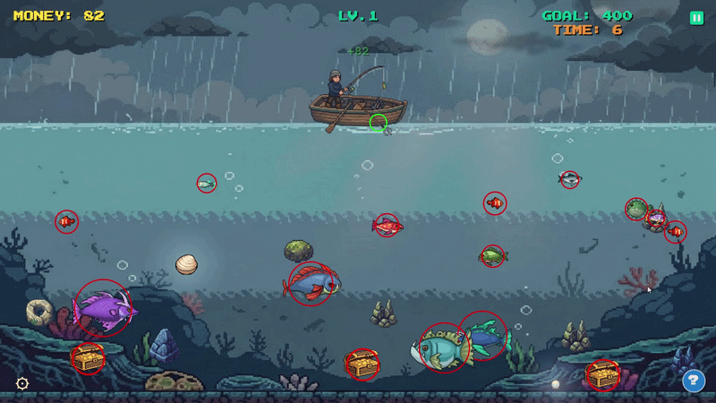
</p>
<br>

### 5.3 Technical Challenge 2: Mathematical Game Balance and Expected Value Framework

The second major technical challenge involved designing a comprehensive game balance system that ensures fair difficulty progression and meaningful strategic choices. Rather than arbitrary score assignments, we developed a mathematical framework to systematically evaluate and balance all catchable items based on expected value optimization.

**Expected Value Framework for Game Design**

We developed an expected value formula to guide our game balance decisions. When designing each item's score value, we consider the player's expected return per unit time invested. The ultimate expected value ($EV$) for targeting a specific item is calculated as:

$$
EV = \frac{E_{theory}}{DF} = \frac{S \cdot 60 \cdot R_{eff}}{50 \cdot D \cdot \left( \frac{1}{5} + \frac{1}{\max(1, 5 - W)} \right) \cdot (1 + 0.3 \cdot V)}
$$

Where:

- $S$ = Item score value (the variable we're designing)
- $D$ = Average distance to target (normalized to typical gameplay distances)
- $W$ = Item weight (SmallFish 2-3, BigFish 6-9, AnglerFish 6-10)
- $V$ = Velocity factor for moving targets (0 for stationary, 0.2-2.5 for fish)
- $R_{eff}$ = Effective capture rate considering player skill and difficulty
- $DF$ = Difficulty factor accounting for miss probability and wasted time

**Formula Components and Design Rationale**

The numerator $S \cdot 60 \cdot R_{eff}$ represents theoretical score gain per minute, scaled by capture success rate. The denominator accounts for multiple cost factors that players implicitly evaluate:

1. **Distance Cost** — $50 \cdot D$ converts pixel distance to time-equivalent metric (at 5 pixels/frame descent speed)
2. **Weight Penalty** — $\left( \frac{1}{5} + \frac{1}{\max(1, 5 - W)} \right)$ exponentially increases cost for heavier items due to slower retrieval
3. **Velocity Penalty** — $(1 + 0.3 \cdot V)$ penalizes fast-moving targets harder to predict and intercept

**Practical Application: Score Balancing**

Using this framework, we systematically balanced all item scores. For example, SmallFish (70-110 pts, weight 2-3, speed 1.2-1.6) have high $EV$ due to abundance and easy capture, serving as reliable "filler" items. BigFish (220-340 pts, weight 6-9, speed 0.3-0.8) offer medium $EV$ with high risk-reward ratio, as heavy weight significantly reduces retrieval speed. AnglerFish (400-800 pts, weight 6-10, speed 0.2-0.5) provide highest $EV$ in deep sea mode, justified by limited visibility and increased difficulty. This mathematical approach ensured consistent difficulty scaling between Shallow Water and Deep Sea modes, validated through our NASA TLX evaluation showing appropriate workload increases without overwhelming players.
<div align="center">
  <font color="#888888">Figure 14: Deep Sea Mode with Limited Visibility</font>
  <br><br>
  
  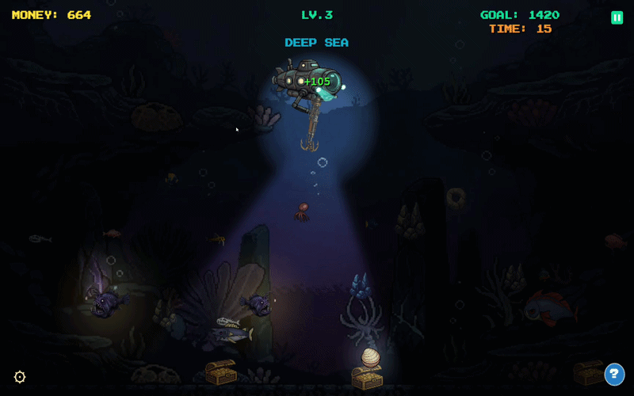
</div>
<br>
### 5.4 Additional Implementation Point: Shared Leaderboard and Fish Collection Index

Beyond the two core technical challenges above, we also implemented a shared leaderboard and a collection-style fish gallery to strengthen replay motivation and social comparison. The key design goal was to keep cloud synchronization lightweight while still preserving meaningful run history.
<br>
<div align="center">
  <font color="#888888">Figure 15: Database schema design of the scores table in Supabase</font><br><br>
  
  
  <br><br><br>

  <font color="#888888">Figure 16: Cloud-synced player records with structured JSON data in Supabase</font><br><br>
  
</div>
<br>
**Cloud-Synced Score Records with Structured Catch Data**

The leaderboard is managed by `HighScoreManager`, which persists local scores in `localStorage` and synchronizes to Supabase on the production deployment. Instead of uploading image assets or bulky binary payloads, each score entry stores structured JSON fields (player name, score, difficulty, mode, and `catch_history`). This design keeps API requests small and fast while preserving the data needed for post-run analysis and display.

```javascript
body: JSON.stringify({
    player_name: name,
    score: score,
    levels_completed: levelsCompleted,
    difficulty: d,
    player_mode: p,
    catch_history: ch,
    per_level_earned: ple,
    per_level_spawn_value: pls,
}),
```
<br>
<p align="center">
  <font color="#888888">Figure 17: Cloud-synced leaderboard data structure</font><br><br>
  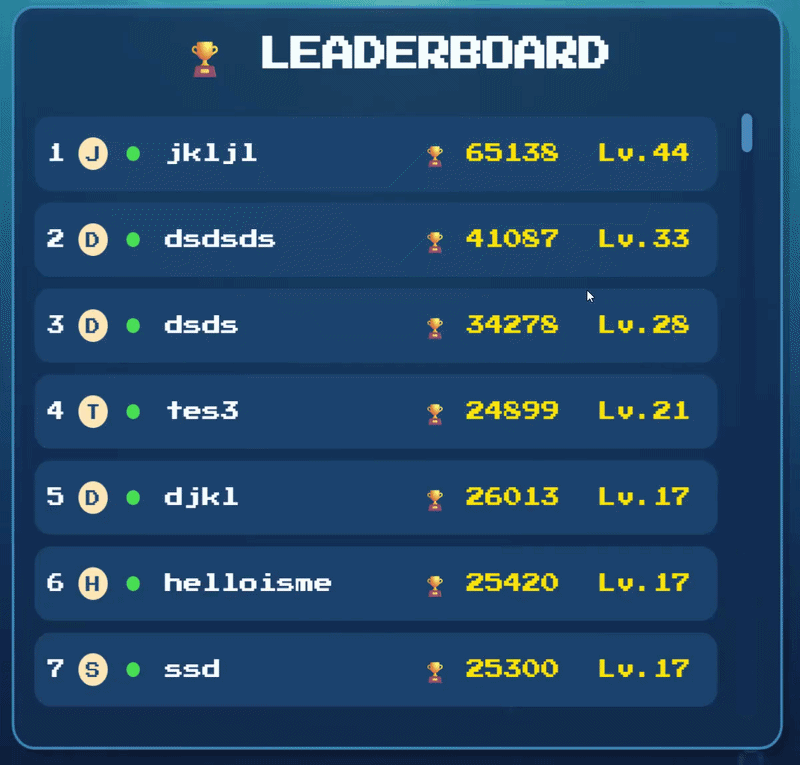
</p>
<br>
**Fish Collection Gallery via Indexed Keys**

To support the gallery efficiently, catches are converted into stable indexed keys at runtime (for example, `fish1`–`fish64`, plus named special fish). `LevelManager` accumulates these counts in `fishCaught`, and `GameManager` merges them into session-wide history before submission. The gallery then maps those keys to preloaded sprite arrays (`imgSmallFishes`, `imgBigFishes`, and special fish assets), so rendering a player's collection requires only numeric counts from the database, not remote image downloads.

This indexing approach gave us the “Pokemon-style” collection feedback loop while avoiding heavy fetch overhead, improving responsiveness on both desktop and lower-bandwidth connections.
<br>
<div align="center">
  <font color="#888888">Figure 18: Fish Gallery (Fish collected by players)</font>
  <br><br>
  
  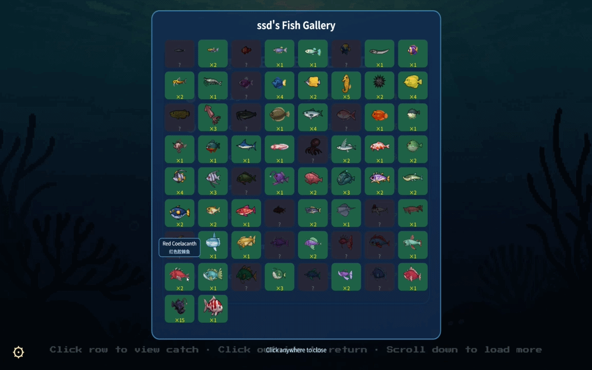
</div>
<br>


<a id="6-evaluation"></a>

## 📊 6. Evaluation

### 6.1 Qualitative Evaluation

<div align="center"><i>Table 4: Results of the Heuristic Evaluation and Severity Ratings</i></div>
<br>

| Interface             | Issue                                                                                                                       | Heuristic(s)                    | Frequency (0–4) | Impact (0–4) | Persistence (0–4) | Severity = (F + I + P) / 3 |
| :-------------------- | :-------------------------------------------------------------------------------------------------------------------------- | :------------------------------ | :-------------: | :----------: | :---------------: | :------------------------: |
| **Game Introduction** | There is no game introduction or tutorial screen, making it unclear how the game mechanics and items work.                  | Help and documentation          |        3        |      3       |         3         |          **3.00**          |
| **Game UI**           | The font color of the current score and remaining time is too similar to the background, reducing readability.              | Aesthetic and minimalist design |        3        |      2       |         3         |          **2.67**          |
| **Feedback System**   | After catching a fish, the value of the fish is not displayed, so players cannot immediately understand the reward gained.  | Visibility of system status     |        3        |      2       |         3         |          **2.67**          |
| **Level Progression** | The interface does not show which level the player is currently in, causing confusion about progression.                    | Visibility of system status     |        2        |      2       |         3         |          **2.33**          |
| **Controls**          | There is no pause function, so players cannot temporarily stop the game when needed.                                        | User control and freedom        |        2        |      2       |         3         |          **2.33**          |
| **Game Objects**      | Some sea creatures look similar in color and shape, making it difficult to distinguish their value or function.             | Consistency and standards       |        2        |      2       |         2         |          **2.00**          |
| **Rules Clarity**     | The special items (e.g., bombs or bonus items) lack clear visual explanation, leading to misunderstanding of their effects. | Recognition rather than recall  |        2        |      2       |         2         |          **2.00**          |
| **Feedback System**   | Audio feedback is subtle, reducing perceived reward when catching rare fish.                                                | Aesthetic and minimalist design |        1        |      2       |         2         |          **1.67**          |
| **End Game Feedback** | The game over screen does not clearly summarize performance (e.g., total score breakdown or level reached).                 | Visibility of system status     |        2        |      2       |         2         |          **2.00**          |
| **Multiplayer**       | In two-player mode, it is unclear which hook belongs to which player.                                                       | Consistency and standards       |        2        |      2       |         2         |          **2.00**          |

<div align="center">
  <font color="#888888">Figure 19: Heuristic Evaluation Feedback Map</font><br><br>
  
</div>
<br>
### 6.2 Quantitative Evaluation

We evaluated usability quantitatively, using two well-established, validated questionnaires and statistical analyses, to ensure the game was both sufficiently challenging and easy to use.

- **Raw NASA TLX** — to measure perceived workload
- **System Usability Scale (SUS)** — to test system usability quantitatively
- **Wilcoxon Signed-Rank Test** — to estimate the statistical significance of the evaluations

#### Process

These evaluations involved 10 participants, each trialing two difficulty modes. Initially, participants struggled to understand the control key of the gameplay, urging us to add short documentation.

#### Raw NASA TLX

**Subscale Workload Scores**

Across all six subscales, the median scores for all participants illustrated a tiny increase with the variance in the level of difficulty (Table 5). The change in median scores only varies slightly.

Table 5: Median NASA TLX subscale scores for all participants

| Scale                          | Median (easy) | Median (Deep Sea) | Δ Median |
| :----------------------------- | :-----------: | :---------------: | :------: |
| Mental Demand                  |      11       |        20         |    9     |
| Physical Demand                |      12       |        14         |    2     |
| Temporal Demand                |      25       |        30         |    5     |
| Frustration                    |      45       |        50         |    5     |
| Effort                         |      35       |        45         |    10    |
| Performance                    |      85       |        88         |    3     |
| **Overall Perceived Workload** |    **36**     |      **38**       |  **2**   |

> _Brief analysis: All 10 participants reported slight differences in overall workload in hard mode than in Easy mode (median 38 vs 36). The increase is small and consistent across participants; the Wilcoxon test (Table 2) found no statistically significant difference, suggesting the difficulty step did not substantially raise perceived workload._

<div align="center">
  
  <br><br>
  <font color="#888888">Figure 20: Comparison of NASA TLX overall perceived workload scores across 10 participants (Easy vs. Deep Sea mode)</font>
</div>
<br>

**Statistical Analysis**

A Wilcoxon Signed-Rank test was performed for each subscale and for overall workload (N = 10, α = 0.05, critical value = 8). As shown in Table 6, the W statistic exceeded the critical value for all seven scales, indicating that the increase in difficulty did not produce a statistically significant difference in perceived workload at either the subscale or overall level.

Table 6: Wilcoxon Signed-Rank Test Results (N = 10, α = 0.05, critical value = 8)

| Scale                | W Statistic | Critical Value | Significant? |
| :------------------- | :---------: | :------------: | :----------: |
| Mental Demand        |     12      |       8        |      No      |
| Physical Demand      |     15      |       8        |      No      |
| Temporal Demand      |     14      |       8        |      No      |
| Frustration          |     16      |       8        |      No      |
| Effort               |     13      |       8        |      No      |
| Performance          |     18      |       8        |      No      |
| **Overall Workload** |   **11**    |     **8**      |    **No**    |

**Solutions and Adjustments**

To create a meaningfully harder experience in hard mode, we implemented several design changes based on the codebase:

1. **target score +30%** and **shorter time limits** (25−levelNum seconds, min 15s) to raise pressure;
2. **faster fish** (1.3–1.8× speed) to increase aiming difficulty;
3. **more obstacles** (guard stones around treasure, 8–12 loose stones in deep sea) to complicate hook paths;
4. **sharks** that steal caught items during reel-up;
5. **limited visibility** (darkness layer with only a cone of light from the submarine) to add spatial uncertainty;
6. **different fish composition** (AnglerFish 400–800 pts, fewer but higher-value targets).

We also rebalanced the economy: **fish values** were adjusted (SmallFish 30–150→10–50, BigFish 250–600→150–350, Treasure 100–500→50–400) to better match level targets; the **shop** was changed from fixed prices to level-scaled pricing so upgrades remain attainable as difficulty rises. The NASA TLX results showed no statistically significant increase in perceived workload, suggesting these changes added challenge without overwhelming players.

#### System Usability Scale (SUS)

**Process**

After finishing the NASA-TLX evaluation, all 10 participants filled out the SUS questionnaire, a standardized tool with 10 questions to measure overall system usability (Lewis, 2018). We calculated scores following the standard SUS methodology.

**Results**

- Mean SUS score (easy) — **88.25**
- Mean SUS score (hard) — **75.0**

<div align="center">
  
  <br><br>
  <font color="#888888">Figure 21: Comparison of System Usability Scale (SUS) scores across 10 participants (Easy vs. Hard mode)</font>
</div>
<br>

Based on our SUS results, all participants rated both difficulty levels above the standard usability benchmark of 68, with Shallow Water averaging 88.25 and Deep Sea averaging 75.0. These scores indicate excellent perceived usability for the easier condition and solidly above‑average usability even in the more challenging Deep Sea mode, suggesting that the game remains easy to use across difficulty levels.

**Statistical Analysis**

A Wilcoxon signed-rank test was conducted to compare SUS scores between the Shallow Water and Deep Sea conditions. For a sample size of 10 at α = 0.05, the critical value of W was 8. The obtained test statistic did not exceed this critical value, indicating no statistically significant difference in perceived usability between the two difficulty levels.

**Solutions and Adjustments**

The SUS confirmed that both difficulty levels offered strong overall usability, but it was less informative for driving concrete design changes than our qualitative observations and NASA TLX workload ratings. Instead, we used the SUS primarily as a summative check to validate that the game provided a positive user experience across conditions. We also noticed indications of questionnaire fatigue, likely because participants completed the SUS immediately after the NASA TLX, which may have reduced how carefully they responded. for the future conduction , we plan to include short breaks or separate the SUS and NASA TLX into different sessions to lower cognitive load and improve response quality.

---

<a id="7-sustainability"></a>

## 🌱 7. Sustainability

### 7.1 Sustainability Analysis Framework (SusAF) Results

We evaluate Deep Sea Prospector using the Sustainability Awareness Framework (SusAF) across five dimensions: technical, environmental, individual, social, and economic.

- **Technical sustainability.** Our object-oriented architecture (`GameManager`, `LevelManager`, `Hook`, `SeaItem` hierarchy) supports maintainability and controlled evolution. This modular design reduces technical debt and makes feature extension (new fish, hazards, and shop items) less costly over time.
- **Environmental sustainability.** We reduce unnecessary computation during real-time rendering and interactions, which lowers device energy use. For example, resource-intensive visual effects are applied selectively, and gameplay logic avoids redundant checks for non-relevant objects.
- **Individual sustainability.** We address privacy, wellbeing, and accessibility together. For privacy, leaderboard records only keep minimal non-sensitive fields (`player_name`, `score`, `levels_completed`, and structured catch data), with no email, location, or financial identifiers. For wellbeing, the game includes adjustable screen brightness (`brightnessLevel`) to reduce eye strain in long sessions. For accessibility and agency, controls remain simple (keyboard-first interaction, clear state transitions), lowering entry barriers for new players.
- **Social sustainability.** Two-player mode and a shared leaderboard strengthen social interaction, comparison, and replay motivation. These systems support a sense of community by enabling cooperative/competitive play and allow players arond different location to be visible to compete .
- **Economic sustainability.** Cloud data access is optimized through paginated leaderboard queries (`limit`/`offset`) and compact score records. This reduces unnecessary bandwidth and storage pressure, helping keep infrastructure usage and operating cost efficient.

Overall, the system balances immediate playability goals with longer-term sustainability outcomes: lower technical maintenance overhead, lighter cloud usage, and inclusive player experience.
<br>
<div align="center">
  <font color="#888888">Figure 22. The Sustainability Awareness Diagram</font>
  <br><br>
  
  
</div>
<br>

### 7.2 Green Foundation Implementation Patterns

Our implementation aligns with practical green software patterns that improve both performance and sustainability outcomes:

- **Efficient algorithms:** Collision checks and state-driven update loops are designed to avoid redundant per-frame computation, especially in dense scenes.
- **Minimal resource usage:** Rendering and UI overlays are applied according to current state (for example, brightness and deep-sea visibility logic), preventing unnecessary full-scene processing.
- **Data minimisation:** Leaderboard records are stored as compact structured fields rather than large payloads, preserving essential analytics with lower transfer and storage cost.
- **Network efficiency:** Supabase leaderboard reads use bounded result windows and incremental loading (`limit=50`, dynamic `offset`) to prevent over-fetching. The ranking endpoint only requests required columns and ordering (for example, `order=levels_completed.desc,score.desc`), which reduces transfer size and cloud query overhead.
- **Modular architecture for sustainable evolution:** Class-based separation of concerns allows targeted optimisation without destabilising unrelated systems.

These patterns jointly reduce computational waste, improve responsiveness on lower-end devices, and support scalable deployment.

### 7.3 Sustainability User Stories and Green Software Foundation Patterns

To operationalise sustainability, we map concrete sustainability user stories to implemented features and measurable outcomes:

- **As a player, I want stable performance during gameplay, so that my device consumes less power and the game remains smooth.**  
We support this through selective update/render logic and lightweight per-frame processing in core loops.
- **As a privacy-conscious user, I want my gameplay data collected minimally, so that I can participate in rankings without exposing sensitive information.**  
We only persist non-sensitive score metadata required for ranking and collection features, and leaderboard fetching is restricted to lightweight ranked fields instead of full user profiles.
- **As a player, I want adjustable visual comfort settings, so that I can play for longer periods without unnecessary eye strain.**  
We provide brightness control in-game and keep core interaction readable under both normal and deep-sea visual conditions.
- **As a community player, I want fair shared progression systems, so that I can engage socially through competition and cooperation.**  
Two-player mode and cloud leaderboard features provide this social layer without high data overhead.
- **As a maintainer, I want code that is easy to extend and optimise, so that sustainability improvements remain feasible as the project grows.**  
Our OOP modular design enables incremental optimisation and future sustainability-focused refactoring.

For future work, we plan to formalise sustainability testing metrics (for example, frame-time stability, load-time targets, and API request efficiency) and include them in backlog and regression checks, ensuring sustainability remains a continuous engineering objective rather than a one-off report section.

---

<a id="8-process"></a>

## 🔄 8. Process


### 8.1 Teamwork

We followed the course week by week and quickly applied what we learned to our team workflow and development process. For example, we kept each task small and specific, asked everyone to commit frequently even for very minor changes, and started creating weekly branches from the second week to manage the game’s versions.

From the third week, we clearly defined the main entry points and scenes of the game, such as the start input page, the game shop, the game manager for score control, the sea item system for generating in-game objects, and the settlement page. Based on that structure, we first built the most basic code framework to make sure everyone worked from a shared standard when developing later on.

During the first five weeks, we did not assign fixed roles in detail. Instead, we divided the work broadly by function: two members focused on the game start and end screens, as well as the early development of the game shop and backend setup, while three members worked on the core game mechanics such as difficulty levels, scene variation, random fish generation, and level design. At the same time, every team member kept playing the game, giving feedback, and asking the responsible person to improve the related part.

As the project progressed, the game evolved from basic interaction logic into a pixel-art style from around week seven. After that, everyone began to optimize their own parts, and we also started sharing assets with one another to further unify the visual style and interaction design. Our roles gradually became more specialized, including front-end asset optimization, game mechanic algorithms, background sound effects, and backend development improvements.

After two to three weeks of playtesting, especially when we moved into qualitative and quantitative evaluation, the whole team focused on improving the scoring system and the shop item exchange algorithm to balance difficulty and playability. We adjusted the game from a linear algorithm that was considered too easy to an exponential one that was then judged too difficult, and we also improved the page display and navigation between scenes so the game became more playable and reasonable.

Because the tasks became more complex over time, there were not many conflicting opinions at the beginning. However, as different scenes and features started interacting with each other, more disagreements naturally appeared. In those situations, we communicated fully, exchanged opinions, explained our reasoning clearly, and finally reached a consensus version as the final one.
<br>
<div align="center" style="white-space: nowrap;">
  
  <div align="center" style="display: inline-block; margin: 0 10px; vertical-align: top;">
    <font color="#888888">Figure 23: Every Week Group Meeting</font><br><br>
    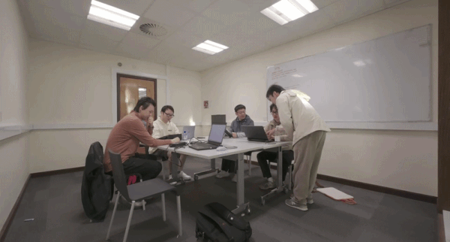
  </div><div align="center" style="display: inline-block; margin: 0 10px; vertical-align: top;">
    <font color="#888888">Figure 24: Group Members Discussion</font><br><br>
    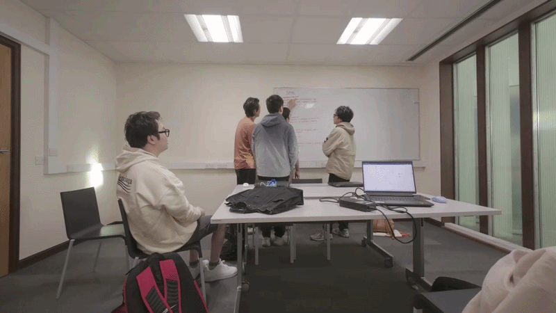
  </div>

</div>
<br>

Our GitHub version control also improved a lot over time. What started as a process where we were not very familiar with handling conflicts eventually became something we managed smoothly and confidently. Since we also deployed the backend database relatively early, the backend playtest data became our main source of quantitative evaluation for game balance and playability, and this provided the foundation for assessing whether the algorithms and overall design were reasonable.


### 8.2 Tools used

**WeChat** as our primary communication tool:

Used to keep all group members updated on weekly progress and task status  
Used to quickly request support from teammates when blockers appeared  
Used to arrange the time and place of our next meetings and coordinate deadlines
<br>
<div align="center">
  
  <div style="margin-bottom: 40px;">
    <font color="#888888">Figure 25: Example of Daily Team Communication</font><br><br>
    
  </div>
  
  <div>
    <font color="#888888">Figure 26: Online video conference</font><br><br>
    
  </div>

</div>
<br>

**GitHub** for version control:

Made sure we committed and pushed stable, working code to shared branches over time to reduce integration risks.  
This also meant that when errors or conflicts appeared, we could always roll back or  refer to the most recent stable version.
Kept commit history clear by using descriptive messages  
Used multiple branches for feature and debug development  and merged changes after they were completed and reviewed/tested  
Followed a structured integration workflow, including branch merges , so alway the latest updated version of working code would be merged to the main branch.
<br>
<div align="center">
  <font color="#888888">Figure 27: Project Git Branching and Merge History</font>
  <br><br>
  
  
</div>
<br>
**Kanban boards**:

Tracked the overall progress of tasks that needed to be completed  
Recorded which member completed each task, so ownership was clear when a finished task needed to be revisited  
Used individual sprint boards to further prioritize the tasks needed for each work session
<div align="center">
  <font color="#888888">Figure 28: Project Kanban Board</font>
  <br><br>
  
  
</div>
<br>

Using these tools gave the team a clearer view of current priorities and individual responsibilities. With frequent board updates, we were able to monitor progress continuously and adjust plans when new challenges emerged. Open communication helped us understand each other's perspectives, strengthen collaboration, and coordinate our work more effectively.

---

<a id="9-conclusion"></a>

## 🏁 9. Conclusion

The development of our game project has been a comprehensive and rewarding experience that significantly enhanced our technical skills, teamwork, and understanding of software engineering practices. Throughout the project, we successfully implemented a range of core features, including the game shop system, leaderboard functionality, and a settings panel for audio and brightness control. These components not only improved the overall gameplay experience but also demonstrated our ability to design and integrate user-focused features within a cohesive system.

One of the key strengths of our project was the use of a modular and incremental development approach. By breaking the system into manageable features—such as shop display optimization, item management, and UI enhancements—we were able to develop, test, and refine each component effectively. The use of GitHub Projects and a Kanban workflow allowed us to track progress clearly, assign responsibilities, and maintain a steady development pace. This agile-inspired process ensured that tasks were completed efficiently and transparently, as reflected in our consistent issue tracking and updates.

However, the project was not without challenges. We encountered difficulties in areas such as UI consistency, feature integration, and debugging unexpected issues (e.g., display bugs and data synchronization problems). In some cases, limited initial planning led to rework, particularly when refining the shop interface and optimizing user interaction. Additionally, we found that more structured testing strategies—such as earlier adoption of systematic testing or clearer separation of logic and presentation—could have reduced debugging time and improved code reliability.

Despite these challenges, our team adapted effectively through regular communication and collaborative problem-solving. By leveraging each member’s strengths and maintaining active discussions, we were able to resolve issues quickly and continue progressing. The project also highlighted the importance of clear task allocation and documentation, especially when working in a shared codebase.

Looking forward, there are several opportunities to further enhance our project. Potential improvements include expanding gameplay features, refining UI/UX design, adding more interactive elements (such as animations and sound effects), and improving system scalability. Additional testing and performance optimization would also help ensure a smoother and more robust user experience across different platforms.

Overall, this project has provided valuable hands-on experience in developing a complete software system within a team environment. It has strengthened our abilities in coding, debugging, version control, and collaborative development. More importantly, it has deepened our appreciation for user-centered design and iterative improvement.

---

<a id="10-contribution-statement"></a>

## 🤝 10. Contribution Statement
<table style="border-collapse: collapse; width: 300px; font-family: Arial, sans-serif; font-size: 14px; background-color: transparent;">
  <caption style="caption-side: top; padding-bottom: 10px; font-weight: bold; text-align: center;">Table 7: Team Members Contribution</caption>
  <thead>
    <tr>
      <th style="border: 1px solid #dcdcdc; padding: 12px 10px; font-weight: bold; text-align: center;">Name</th>
      <th style="border: 1px solid #dcdcdc; padding: 12px 10px; font-weight: bold; text-align: center;">Contribution</th>
    </tr>
  </thead>
  <tbody>
    <tr>
      <td style="border: 1px solid #dcdcdc; padding: 12px 10px; text-align: center;">Weikai Mao</td>
      <td style="border: 1px solid #dcdcdc; padding: 12px 10px; text-align: center;">20%</td>
    </tr>
    <tr>
      <td style="border: 1px solid #dcdcdc; padding: 12px 10px; text-align: center;">Zenan Wu</td>
      <td style="border: 1px solid #dcdcdc; padding: 12px 10px; text-align: center;">20%</td>
    </tr>
    <tr>
      <td style="border: 1px solid #dcdcdc; padding: 12px 10px; text-align: center;">Jianxing Li</td>
      <td style="border: 1px solid #dcdcdc; padding: 12px 10px; text-align: center;">20%</td>
    </tr>
    <tr>
      <td style="border: 1px solid #dcdcdc; padding: 12px 10px; text-align: center;">Bingyu Ke</td>
      <td style="border: 1px solid #dcdcdc; padding: 12px 10px; text-align: center;">20%</td>
    </tr>
    <tr>
      <td style="border: 1px solid #dcdcdc; padding: 12px 10px; text-align: center;">Zeyu Guo</td>
      <td style="border: 1px solid #dcdcdc; padding: 12px 10px; text-align: center;">20%</td>
    </tr>
  </tbody>
</table>
---

<a id="11-appendix"></a>

## 🤖 11. AI Statement

Throughout the development of Deep Sea Prospector, Artificial Intelligence (AI) tools were utilized selectively to assist with specific aspects of the project, ensuring efficiency while maintaining human creative control over the core design and mechanics. In accordance with academic integrity guidelines, our use of AI was transparently limited to the following two areas:

1. Game Asset Generation
We utilized generative Nanobanana2 to assist in the ideation and creation of 2D visual assets. AI was primarily used to draft initial concepts and generate raw image sprites for certain in-game elements, such as specific marine life and background textures. Following generation, all AI-assisted assets were heavily modified, cropped, and colour-corrected manually by our Asset Creators to ensure they matched our cohesive pixel-art aesthetic and met the precise hitbox requirements of our collision system.
<div align="center">
  <i>Figure 29: the final manually edited sprites.</i>
  <br><br>
  
  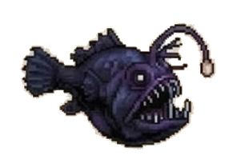
  &nbsp; &nbsp; &nbsp; 
  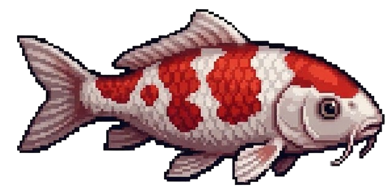
</div>

2. Test Script Generation
We employed Claude code to support our quality assurance process by assisting with the drafting of test code. AI tools were used to quickly generate boilerplate code, format test structures, and suggest edge-case scenarios for our physics and collision boundary tests. All AI-generated test scripts were strictly reviewed, refined, and verified by our Test Engineer to ensure they accurately reflected our system architecture and evaluated the correct acceptance criteria.

All core gameplay programming, object-oriented architecture design, level balancing (including the Expected Value Framework), and the drafting of this report were completed entirely by the human development team.

---

<a id="12-references"></a>

## 📚 12. References

* Beck, K. (2002) *Test-Driven Development: By Example*. Boston: Addison-Wesley.
* Chacon, S. and Straub, B. (2014) *Pro Git*. 2nd edn. New York: Apress.
* Gamma, E., Helm, R., Johnson, R. and Vlissides, J. (1995) *Design Patterns: Elements of Reusable Object-Oriented Software*. Reading, MA: Addison-Wesley.
* Rubin, K.S. (2012) *Essential Scrum: A Practical Guide to the Most Popular Agile Process*. Upper Saddle River, NJ: Addison-Wesley.
* Schell, J. (2019) *The Art of Game Design: A Book of Lenses*. 3rd edn. Boca Raton, FL: CRC Press.
