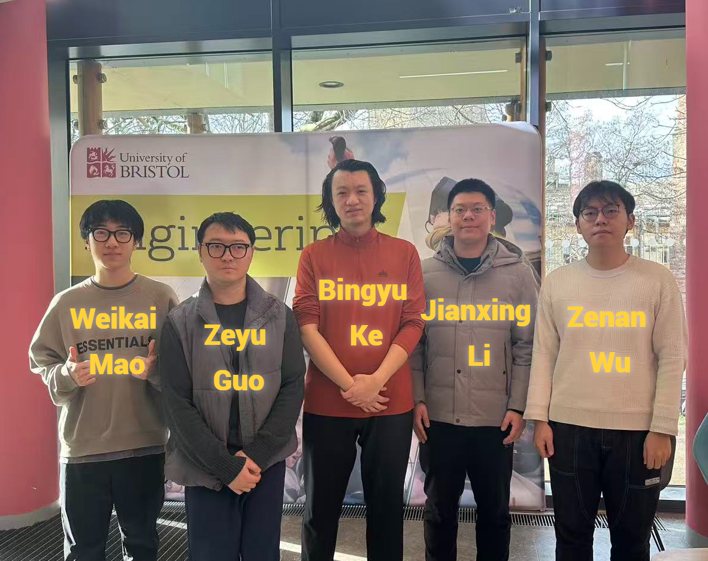

# 2026-group-4

2026 COMSM0166 group 4

## Group Kanban Board

[Kanban Board](https://github.com/orgs/UoB-COMSM0166/projects/76)

## Table of Contents
1. [Development Team](#1-development-team)
2. [Introduction](#2-introduction)
3. [Requirements](#3-requirements)
4. [Design](#4-design)
5. [Implementation](#5-implementation)
6. [Evaluation](#6-evaluation)
7. [Sustainability](#7-sustainability)
8. [Process](#8-process)
9. [Conclusion](#9-conclusion)
10. [Contribution Statement](#10-contribution-statement)
11. [Appendix](#11-appendix)
12. [References](#12-references)

## 1. Development Team

  

| Name | Email | Github | Role |
| :--- | :--- | :--- | :--- |
| Weikai Mao | uz25020@bristol.ac.uk | M1yanoShiho | - |
| Zenan Wu | jp25459@bristol.ac.uk | zenanwu479-glitch | - |
| Jianxing Li | ue25937@bristol.ac.uk | UoB26Git | - |
| Bingyu Ke | wp25446@bristol.ac.uk | Howard Ke | - |
| Zeyu Guo | rp23254@bristol.ac.uk | bytevostg | - |
| - | - | - | - |

## 2. Introduction

A project template for the Software Engineering Discipline and Practice module (COMSM0166).

### Info

This is the template for your group project repo/report. We'll be setting up your repo and assigning you to it after the group forming activity. You can delete this info section, but please keep the rest of the repo structure intact.

You will be developing your game using [P5.js](https://p5js.org) a javascript library that provides you will all the tools you need to make your game. However, we won't be teaching you javascript, this is a chance for you and your team to learn a (friendly) new language and framework quickly, something you will almost certainly have to do with your summer project and in future. There is a lot of documentation online, you can start with:

* [P5.js tutorials](https://p5js.org/tutorials/)
* [Coding Train P5.js](https://thecodingtrain.com/tracks/code-programming-with-p5-js) course - go here for enthusiastic video tutorials from Dan Shiffman (recommended!)

### Your Game (change to title of your game)

STRAPLINE. Add an exciting one sentence description of your game here.

IMAGE. Add an image of your game here, keep this updated with a snapshot of your latest development.

LINK. Add a link here to your deployed game, you can also make the image above link to your game if you wish. Your game lives in the [/docs](/docs) folder, and is published using Github pages.

VIDEO. Include a demo video of your game here (you don't have to wait until the end, you can insert a work in progress video)

### Report Guidance

* 5% ~250 words
* Describe your game, what is based on, what makes it novel? (what's the "twist"?)

## 3. Requirements

* 15% ~750 words
* Early stages design. Ideation process. How did you decide as a team what to develop? Use case diagrams, user stories.

## 4. Design

* 15% ~750 words
* System architecture. Class diagrams, behavioural diagrams.

## 5. Implementation

* 15% ~750 words
* Describe implementation of your game, in particular highlighting the TWO areas of *technical challenge* in developing your game.

## 6. Evaluation

* 15% ~750 words
* One qualitative evaluation (of your choice)
* One quantitative evaluation (of your choice)
* Description of how code was tested.

## 7. Sustainability

Add your sustainability discussion here.

## 8. Process

* 15% ~750 words
* Teamwork. How did you work together, what tools and methods did you use? Did you define team roles? Reflection on how you worked together. Be honest, we want to hear about what didn't work as well as what did work, and importantly how your team adapted throughout the project.

## 9. Conclusion

* 10% ~500 words
* Reflect on the project as a whole. Lessons learnt. Reflect on challenges. Future work, describe both immediate next steps for your current game and also what you would potentially do if you had chance to develop a sequel.

## 10. Contribution Statement

* Provide a table of everyone's contribution, which *may* be used to weight individual grades. We expect that the contribution will be split evenly across team-members in most cases. Please let us know as soon as possible if there are any issues with teamwork as soon as they are apparent and we will do our best to help your team work harmoniously together.

## 11. Appendix

Additional marks guidance:
You can delete this section in your own repo, it's just here for information. In addition to the marks above, we will be marking you on the following two points:

* **Quality** of report writing, presentation, use of figures and visual material (5% of report grade)

  * Please write in a clear concise manner suitable for an interested layperson. Write as if this repo was publicly available.

* **Documentation** of code (5% of report grade)

  * Organise your code so that it could easily be picked up by another team in the future and developed further.
  * Is your repo clearly organised? Is code well commented throughout?

## 12. References

Add your references here.
